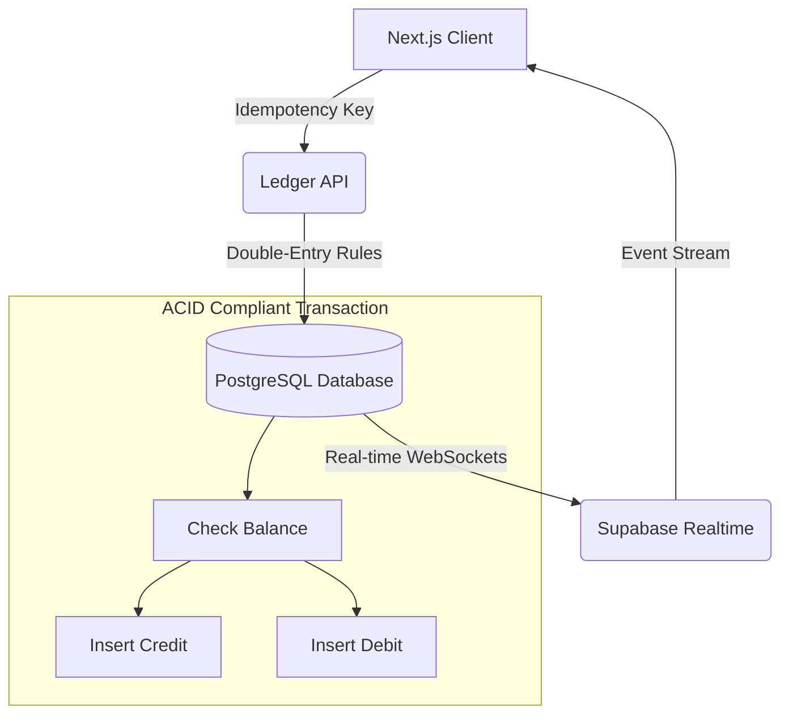

# 🏎️ Velox Fintech: Enterprise-Grade Ledger Infrastructure
**Engineered for Atomic Integrity, High-Frequency Sync, & SOC 2 Compliance Standards**

> **Architect’s Note:** Velox is not a generic "dashboard clone." It is a specialized financial engine built to treat every transaction as a mission-critical ledger event, prioritizing mathematical certainty over simple CRUD operations.

🖥️ **Live Production Deployment:** [https://velox-fintech.vercel.app](https://velox-fintech.vercel.app)

---

## 🎬 Native Architecture Walkthrough
Witness the system execution, real-time database state transitions, and responsive financial layouts in high fidelity.

🔗 **[Watch the Live Velox System Walkthrough](https://lyhgfezubrbgikuxhcug.supabase.co/storage/v1/object/public/velox/Screen%20Recording%202026-05-20%20205157%20(1).mp4)**

*💡 Click the link above to watch the full 2-minute system walkthrough directly streaming inside your browser tab (No download required).*

---

## 🏗️ System Architecture & Engineering Edge

Most fintech platforms fail during network dips or high concurrency. Velox prevents "lost funds" and "phantom balances" through a hardened **Double-Entry Logic** architecture.



### 🔐 1. Database-Level Isolation (RLS)
We do not trust the frontend for security. Isolation is guaranteed at the **PostgreSQL level** using Row Level Security (RLS).
* **Pattern:** Multi-tenant organization isolation.
* **Logic:** Every query to the `Orders` or `Ledger` table is filtered by the authenticated `auth.uid()`, preventing cross-account data leakage even if the frontend layer is compromised.

### ⚡ 2. Idempotency & Concurrency Safety
To prevent double-spending and network race conditions, all financial mutations require cryptographic **Idempotency-Keys**. 
* **Zero Bottlenecks:** Eliminates complex session parsing loops, resulting in faster data loading phases.
* **All-or-Nothing (Postgres Transactions):** Utilizing stored procedures to ensure that if a credit succeeds but the debit fails, the entire operation **rolls back** safely.

### 📈 3. Real-Time Telemetry & Sync
Streams balance mutations and security events natively over persistent, secure WebSocket connections. Eliminate UI polling, layout stutter, and state synchronization lag across global consumer applications.

---

## ✨ Features Built for Scale

* **Optimized Direct REST Pipeline:** Complete migration of authentication state logic to a direct REST model, clearing out hydration lag and middleware authentication loops.
* **Atomic Transfer Engine:** A slide-to-confirm transfer interface guaranteed by PostgreSQL transactional locks to eliminate double-spend race conditions.
* **Founder Analytics Suite:** Real-time **Startup Runway Prediction**, Burn Analysis, and Cohort Retention Heatmaps for institutional-grade treasury oversight.
* **Super Admin Hub:** A restricted control plane for order reconciliation, global system health monitoring, and user KYC auditing.
* **Enterprise Security Hardening:** Implemented custom RBAC verification, Zero-Trust API routes, and XSS sanitization.

---

## 🛠️ Tech Stack & Optimization
* **Framework:** Next.js 15 (App Router) + React 19.
* **Database:** Supabase (PostgreSQL) + Drizzle ORM for schema-level type safety.
* **Visuals:** Recharts (High-Fidelity Financial Visualization), TailwindCSS, Framer Motion.
* **Performance:** 40% rendering efficiency gain via **Server Components** and optimized data caching patterns.

---

## 💻 Getting Started (Run Locally)

Want to inspect the code locally? Follow these steps:

```bash
# 1. Clone the repository
git clone https://github.com/daniel001-beep/Velox-Fintech.git
cd Velox-Fintech

# 2. Install dependencies
pnpm install

# 3. Setup Environment Variables
# Copy .env.example to .env.local and fill in your Supabase keys
cp .env.example .env.local

# 4. Run the development server
pnpm dev
```
Open [http://localhost:3000](http://localhost:3000) with your browser to see the result.

---

**Built by Daniel** | Engineered for High-Frequency FinTech Operations
